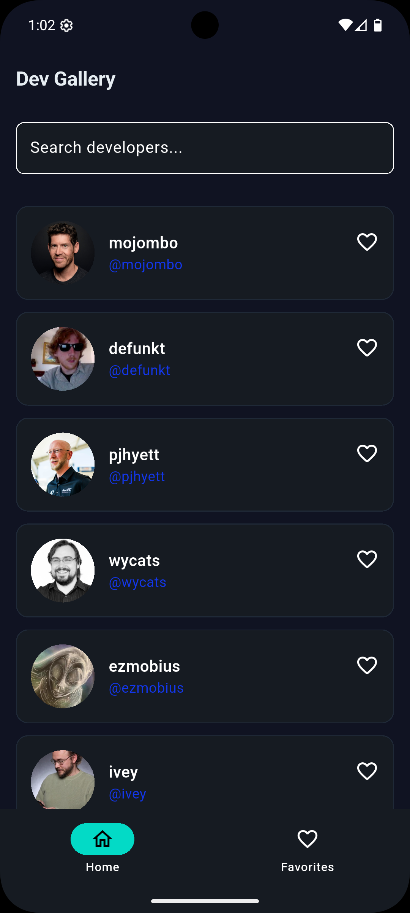
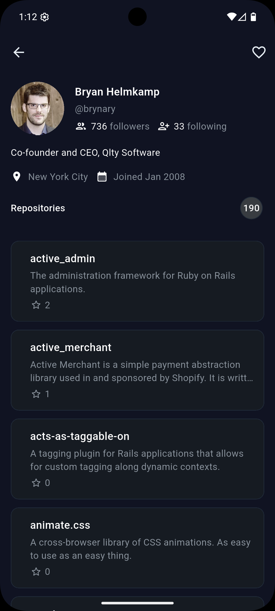
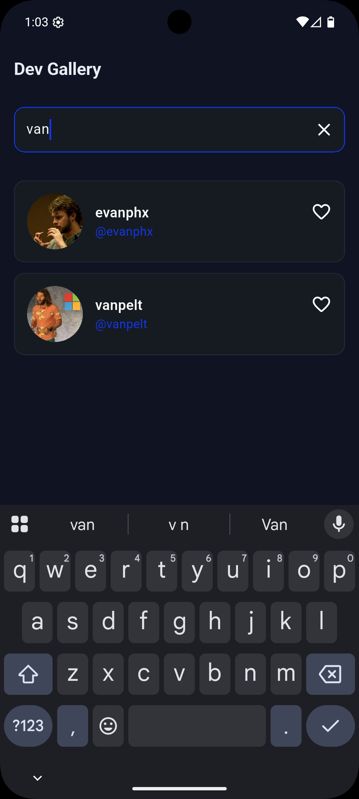
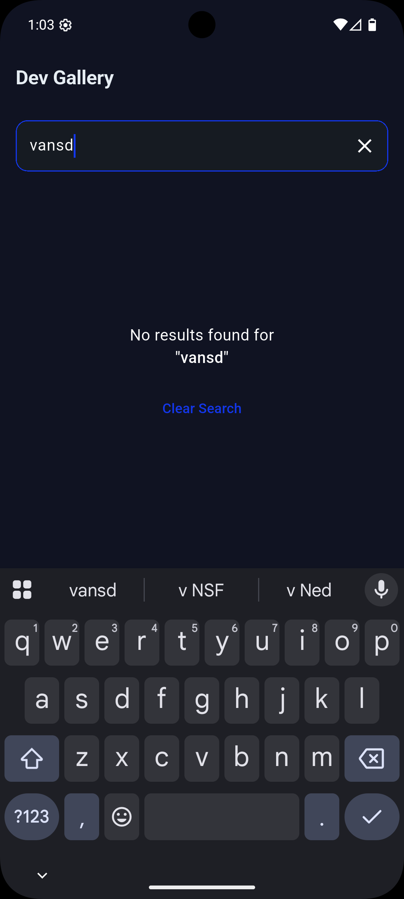
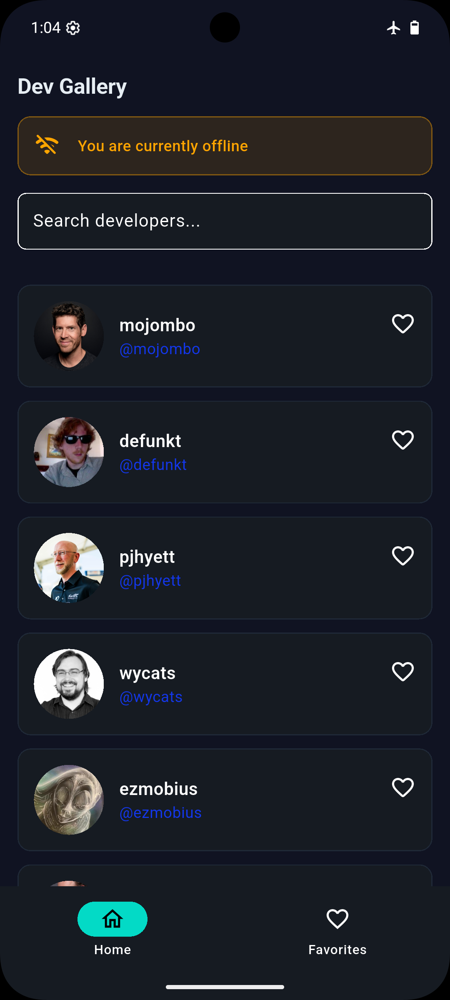
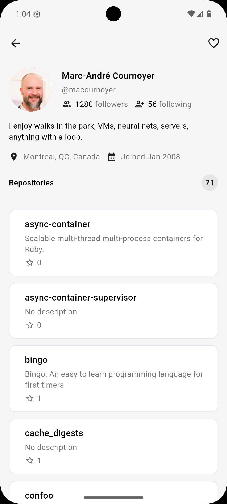

# DevGallery

DevGallery is a Flutter app that displays GitHub developers, their details, and public repositories.  
The project follows Clean Architecture with BLoC state management, Dio for networking, Hive for offline caching, and GoRouter for navigation.

---

## 📦 Setup Instructions

1. **Clone the repository**
```sh
git clone https://github.com/md4msb/dev_gallery.git
cd dev_gallery
```

2. **Install dependencies**
```sh
flutter pub get
```

3. **Run the app**
```sh
flutter run
```
No additional configuration is required.  
Hive initializes automatically on app startup.

---

## 🏛 Architecture & Design Choices

This project uses **Clean Architecture** to ensure separation of concerns, scalability, and testability.  
The codebase is divided into three primary layers:

### **1. Domain Layer**
- Contains **Entities**, **Repositories (abstract)**, and **UseCases**  
- Pure business logic, no Flutter or platform dependencies  
- Ensures testability and independence from UI or external APIs  

### **2. Data Layer**
- Contains **Models**, **Remote Data Sources**, **Local Data Sources**, and **Repository Implementations**  
- Responsible for:
  - API calls using **Dio**
  - Offline caching using **Hive**
  - Error handling using a centralized handler
- Maps API models → domain entities  

### **3. Presentation Layer**
- Built using the **BLoC** pattern  
- Contains:
  - Blocs
  - Events & States
  - Screens & UI widgets
- UI never interacts directly with API or cache — everything flows through the domain layer  

### **Navigation**
- Managed using **GoRouter** for predictable, scalable routing  

### **local Search**
- Implemented purely inside the presentation layer  
- Uses two lists inside the Bloc:
  - `developers` → master list
  - `searchDevs` → filtered search results  
- Ensures search does not modify actual screen state  

### **Offline Support**
- Before any API call, network connectivity is checked  
- If offline → data is loaded from Hive  
- If online → fresh data fetched & cached  

---

## 🧠 Why BLoC for State Management?

BLoC was chosen because:

- It fits naturally with **Clean Architecture**
- Clearly separates UI from business logic
- Ensures **predictable**, **testable** states
- Ideal for apps requiring:
  - search  
  - offline/online switching  
  - pagination  
  - multiple screens sharing the same data  
- Works great with streams & reduces unnecessary rebuilds
- Makes future scalability (favorites, pagination) easy  

BLoC gives the project long-term stability and enterprise-level structure.

---

## 📸 Screenshots

<p align="center">
  
  
  
</p>

<p align="center">
  
  
  
</p>

---

## 📝 Notes
(favorites, pagination, tests) were prepared in architecture but not fully implemented due to time constraints.

---

## 👨‍💻 Author
**Muhammad Shuhaib**  
